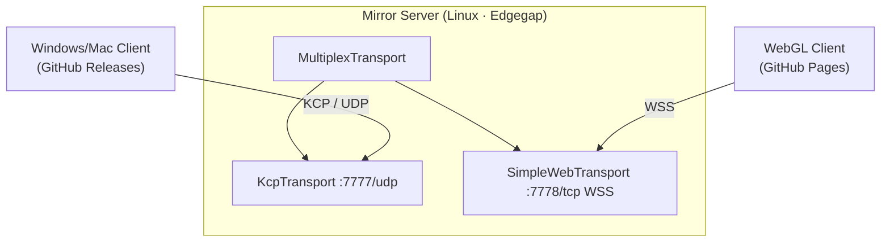

# socketio-unity-mirror-server

Deployable Mirror dedicated server for [socketio-unity](https://github.com/Magithar/socketio-unity). KCP for native clients, WebSocket for WebGL. Hosted on Edgegap.

## What's here

- **Mirror dedicated server** — Linux headless, packaged as a Docker image, deployed to Edgegap.
- **MultiplexTransport** — KCP (UDP/7777) for PC/Mac clients, SimpleWebTransport (WSS/7778) for WebGL clients.
- CI builds and pushes the Docker image to Edgegap on every push to `main`.

Clients (WebGL + Windows/Mac) live in the [socketio-unity](https://github.com/Magithar/socketio-unity) repo.

## Architecture

## Full Setup Guide

See [SETUP.md](SETUP.md) for the complete end-to-end process: build → GitHub Release → CI → Edgegap version → deploy → Render env vars → Unity test.

## Setup

### 1. Open the Unity project

The Unity project is already in this repo at `mirror-server-demo/`. Open it in Unity Hub (Unity 6.3 LTS).

### 2. Configure the NetworkManager

- Add `MultiplexTransport`, `KcpTransport`, `SimpleWebTransport` components to the NetworkManager GameObject
- MultiplexTransport → Transports = [KcpTransport, SimpleWebTransport]
- NetworkManager → Transport = MultiplexTransport
- NetworkManager → Headless Start Mode = `Auto Start Server`
- KcpTransport → Port `7777`
- SimpleWebTransport → Port `7778`, Client Use WSS = true

### 3. Add GitHub secrets

Repo Settings → Secrets and variables → Actions:

| Secret | Value |
|---|---|
| `EDGEGAP_REGISTRY_USER` | Edgegap registry username |
| `EDGEGAP_REGISTRY_TOKEN` | Edgegap registry token |
| `EDGEGAP_ORG` | Your Edgegap org slug |

### 4. Configure Edgegap app

Edgegap dashboard → Applications → New → point at `registry.edgegap.com/<org>/mirror-server`.

App Version → add two ports:

| Port | Protocol | Transport |
|---|---|---|
| `7777` | UDP | KCP (native clients) |
| `7778` | WS | SimpleWebTransport (WebGL — Edgegap terminates TLS) |

## Deploy

1. Build the Linux dedicated server locally in Unity: **File → Build Settings → Server Build → Build**.
2. Zip the output: `zip -j server-linux.zip <build-output-dir>/*`
3. Publish a GitHub Release and attach `server-linux.zip` as a release asset.

The `build-server.yml` workflow fires on release publish, downloads the zip, packages it as a Docker image, and pushes to Edgegap's container registry.

Then in the Edgegap dashboard → select latest app version → **Deploy**.

## Lobby server (Render)

The dedicated server address/ports are injected into `match_started` by the lobby server (`mirror-server.js` on Render). Set these three env vars in Render after each new Edgegap deployment:

| Key | Value |
|-----|-------|
| `MIRROR_SERVER_ADDRESS` | `<edgegap-fqdn>.pr.edgegap.net` |
| `MIRROR_KCP_PORT` | external UDP port |
| `MIRROR_WS_PORT` | external TCP/WS port |

Render auto-redeploys on save. Clients receive the address and ports in `match_started` — no client changes needed.

## Connect clients

After deploy, the Edgegap dashboard shows the host URL and external ports:

- **Native (Win/Mac)**: `ServerMode = DedicatedKCP` in `MirrorGameOrchestrator`
- **WebGL**: `ServerMode = DedicatedWebSocket`

## Free tier

Edgegap's Mirror-partner free tier provides 1.5 vCPU. Stop deployments when not testing — they consume the allowance while running.

## Keeping scripts in sync

This project imports sample scripts from `com.magithar.socketio-unity`. When those scripts are updated in the main repo, copy the updated files to `Assets/Samples/Socket.IO Unity Client/1.4.0/` — or in Unity Package Manager, remove and re-import the affected samples.

Scripts that must stay in sync: `LobbyStateStore`, `LobbyNetworkManager`, `LobbyUIController`, `MirrorGameOrchestrator`.

## Related

- Client builds + demo scene: [socketio-unity](https://github.com/Magithar/socketio-unity)
- Mirror docs: https://mirror-networking.gitbook.io/docs
- Edgegap docs: https://docs.edgegap.com
