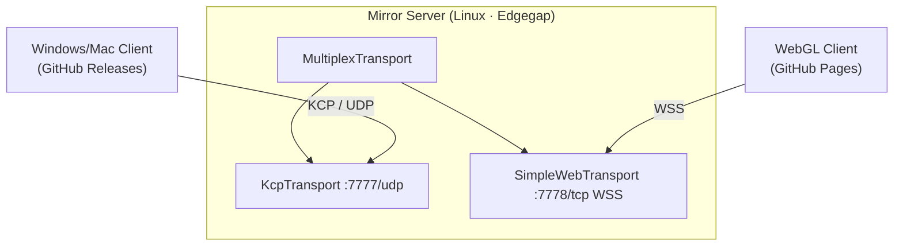

# socketio-unity-mirror-server

Deployable Mirror dedicated server for [socketio-unity](https://github.com/Magithar/socketio-unity). KCP for native clients, WebSocket for WebGL. Hosted on Edgegap.

## What's here

- **Mirror dedicated server** — Linux headless, packaged as a Docker image, deployed to Edgegap.
- **MultiplexTransport** — KCP (UDP/7777) for PC/Mac clients, SimpleWebTransport (WSS/7778) for WebGL clients.
- CI builds and pushes the Docker image to Edgegap on every push to `main`.

Clients (WebGL + Windows/Mac) live in the [socketio-unity](https://github.com/Magithar/socketio-unity) repo.

## Architecture



## Setup

### 1. Create the Unity project in this folder

Open Unity Hub → New Project → location = this repo root → Unity 6.3 LTS.

After Unity finishes, add packages via Window → Package Manager → Add from Git URL:

```
https://github.com/Magithar/socketio-unity.git
```

Then import Mirror from the Asset Store or your preferred UPM source.

### 2. Configure the NetworkManager

- Add `MultiplexTransport`, `KcpTransport`, `SimpleWebTransport` components to the NetworkManager GameObject
- MultiplexTransport → Transports = [KcpTransport, SimpleWebTransport]
- NetworkManager → Transport = MultiplexTransport
- NetworkManager → Headless Start Mode = `Auto Start Server`
- KcpTransport → Port `7777`
- SimpleWebTransport → Port `7778`, Client Use WSS = true

### 3. Add GitHub secrets

Repo Settings → Secrets and variables → Actions:

| Secret | Value |
|---|---|
| `UNITY_LICENSE` | Contents of your `Unity_v*.ulf` license file |
| `UNITY_EMAIL` | Unity account email |
| `UNITY_PASSWORD` | Unity account password |
| `EDGEGAP_REGISTRY_USER` | Edgegap registry username |
| `EDGEGAP_REGISTRY_TOKEN` | Edgegap registry token |
| `EDGEGAP_ORG` | Your Edgegap org slug |

Generate a Unity license file: follow [GameCI activation](https://game.ci/docs/github/activation).

### 4. Configure Edgegap app

Edgegap dashboard → Applications → New → point at `registry.edgegap.com/<org>/mirror-server`.

App Version → add two ports:

| Port | Protocol | Transport |
|---|---|---|
| `7777` | UDP | KCP (native clients) |
| `7778` | WS | SimpleWebTransport (WebGL — Edgegap terminates TLS) |

## Deploy

Push to `main`. The `build-server.yml` workflow:
1. Builds the Linux dedicated server via GameCI
2. Packages it as a Docker image
3. Pushes to Edgegap's container registry

Then in the Edgegap dashboard → select latest app version → **Deploy**.

## Connect clients

After deploy, the Edgegap dashboard shows the host URL and external ports:

- **Native (Win/Mac)**: NetworkAddress = `<edgegap-host>`, port = external UDP port
- **WebGL**: NetworkAddress = `wss://<edgegap-host>:<external-ws-port>`

## Free tier

Edgegap's Mirror-partner free tier provides 1.5 vCPU. Stop deployments when not testing — they consume the allowance while running.

## Related

- Client builds + demo scene: [socketio-unity](https://github.com/Magithar/socketio-unity)
- Mirror docs: https://mirror-networking.gitbook.io/docs
- Edgegap docs: https://docs.edgegap.com
