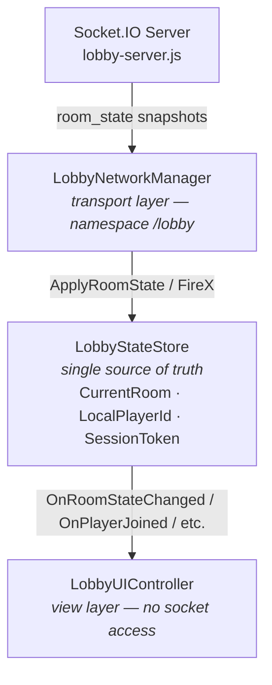
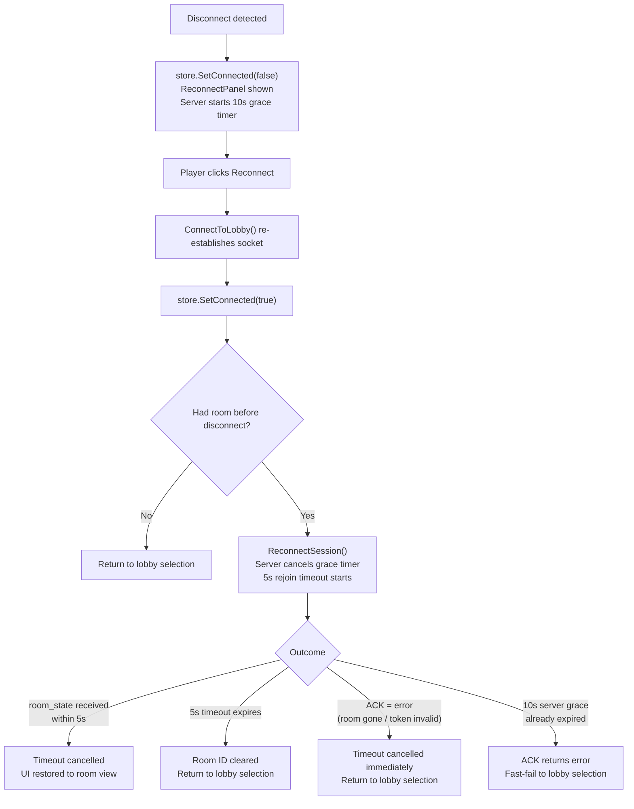

# Unity Multiplayer Lobby — Socket.IO

A production-style multiplayer lobby for Unity demonstrating reconnect recovery, host migration, session identity, and clean three-layer networking architecture.

---

## Demo

> _Screenshot or GIF here — players joining, host disconnecting, host migrating, player reconnecting._

---

## Features

- Room creation and join-by-code (6-character codes, e.g. `C9N7GR`)
- Persistent player identity — `playerId` separate from `socket.id`, survives reconnects
- Session token authentication — prevents player slot spoofing on reconnect
- 10-second reconnect grace window — room slot held while player is offline
- Host migration — automatically promotes next connected player when host leaves
- Full WebGL support — automatic transport detection via `TransportFactoryHelper`
- Trace-based structured server logs — per-player `traceId` stable across reconnects

---

## Why This Project Exists

Most Unity networking samples focus on a specific SDK or transport layer. This project focuses on the architecture underneath: reconnect recovery, host migration, session identity, and clean separation between transport, state, and UI. The Socket.IO layer is swappable — the patterns are the point.

---

## Quick Start

```bash
npm install
npm run start:lobby   # or: npm run dev:lobby (auto-restart)
```

```
Open LobbyScene in Unity → Press Play → Enter name → Create or Join Room
```

Server output:
```
🚀 Lobby server running on http://localhost:3001
🛰  Socket.IO namespace: /lobby
```

To test multiplayer: build a standalone or open a second Unity Editor instance.

---

## Architecture

Three clean layers — no layer crosses its boundary:



### Component Responsibilities

| Component | Role |
|-----------|------|
| **LobbyNetworkManager** | Transport layer. Manages `/lobby` namespace socket. Emits all client actions, receives events, feeds state into `LobbyStateStore` |
| **LobbyStateStore** | Single source of truth. Owns `CurrentRoom`, `LocalPlayerId`, `SessionToken`, `IsConnected`. Fires 8 semantic C# events. Handles player list diffing |
| **LobbyUIController** | View layer. Subscribes to store events only. Manages player row lifecycle via `_playerRows` dictionary and reconnect/rejoin coroutines |
| **RoomState** | Data model for the full room snapshot |
| **LobbyPlayer** | Data model for a single player entry |

### LobbyNetworkManager Public API

| Method / Property | Description |
|---|---|
| `Socket` | `SocketIOClient` reference — used by Mirror Integration's `GameEventBridge` to call `.Of("/game")` |
| `CreateRoom(string name)` | Emit `create_room`; ack sets `LocalPlayerId` + `SessionToken` |
| `JoinRoom(string roomId, string name)` | Emit `join_room` |
| `LeaveRoom()` | Emit `leave_room`; resets store |
| `SetReady(bool ready)` | Emit `player_ready` |
| `StartMatch(string sceneName, string hostAddress)` | Host only. Emits `start_match { sceneName, hostAddress }` — `hostAddress` is auto-detected by `LobbyUIController` or set via the `Host Address Override` inspector field |
| `ReconnectSession(playerId, roomId, sessionToken)` | Restore a session within the 10-second grace window |
| `Reconnect()` | Re-establish the socket connection (does not restore session) |

### LobbyStateStore Events

| Event | Signature | Fires when |
|---|---|---|
| `OnConnected` | `Action` | `/lobby` namespace connects |
| `OnDisconnected` | `Action` | Root socket state → `Disconnected` |
| `OnRoomStateChanged` | `Action<RoomState>` | Authoritative room snapshot received |
| `OnPlayerJoined` | `Action<LobbyPlayer>` | New player detected in room state diff |
| `OnPlayerLeft` | `Action<string>` | Player absent from room state diff (playerId) |
| `OnPlayerRemoved` | `Action<string, string, string>` | Server explicitly removes player (playerId, name, reason) |
| `OnError` | `Action<SocketError>` | Socket or auth error |
| `OnMatchStarted` | `Action<string, string>` | Match confirmed by backend (sceneName, hostAddress) |

---

## Reconnect Flow



---

## Socket.IO Events Reference

| Event | Direction | Purpose |
|-------|-----------|---------|
| `create_room` | Client → Server (ack) | Create a new room; ack: `{ ok, roomId, playerId, sessionToken }` |
| `join_room` | Client → Server (ack) | Join existing room; ack: `{ ok, roomId, playerId, sessionToken }` |
| `reconnect_player` | Client → Server (ack) | Restore a session within grace window; sends `{ playerId, roomId, sessionToken }`; ack: `{ ok, roomId, playerId }` |
| `leave_room` | Client → Server (ack) | Intentional exit; no grace period |
| `player_ready` | Client → Server | Toggle or set ready state |
| `start_match` | Client → Server | Host only; emits `match_started` to room; `{ sceneName, hostAddress }` |
| `player_identity` | Server → Client | Sent before ACK on create/join; `{ playerId, sessionToken }` — guarantees client knows its ID before `room_state` arrives |
| `room_state` | Server → Client | Full authoritative room snapshot |
| `player_removed` | Server → Client | Player permanently removed; `{ playerId, name, reason }` where reason is `"left"` or `"reconnect_timeout"` |
| `match_started` | Server → Client | Host started the match; `{ sceneName, hostAddress }` — `hostAddress` is nullable, used by Mirror Integration for P2P host mode |

---

## Room State Structure

```json
{
  "roomId": "C9N7GR",
  "hostId": "abc123def",
  "version": 4,
  "players": [
    { "id": "abc123def", "name": "jason", "ready": true,  "status": "connected" },
    { "id": "xyz789ghi", "name": "hello", "ready": false, "status": "disconnected" }
  ]
}
```

`status` is `"connected"` normally. During the 10-second reconnect grace period it becomes `"disconnected"` — the player row shows `(Reconnecting...)` and the ready icon turns yellow. After the grace period expires the player is removed entirely.

---

## Server Logs

The server emits structured logs with stable per-player trace IDs that survive socket reconnects:

```
[Lobby] 🔌 socket connected: sckAbC
[Lobby][T:a3f9bc][Room:C9N7GR][P:abc123def] 🏠 room created by "jason" socket=sckAbC
[Lobby][Room:C9N7GR] state broadcast v1 players=1 host=abc123def

[Lobby][T:ee1204][Room:C9N7GR][P:xyz789ghi] 🚪 "hello" joined socket=sckDeF
[Lobby][Room:C9N7GR] state broadcast v2 players=2 host=abc123def

[Lobby][T:a3f9bc][Room:C9N7GR][P:abc123def] ⚠️  "jason" disconnected — grace 10s started
[Lobby][Room:C9N7GR] state broadcast v3 players=2 host=abc123def
[Lobby][T:a3f9bc][Room:C9N7GR] 👑 host migrated abc123def → xyz789ghi
[Lobby][Room:C9N7GR] state broadcast v4 players=2 host=xyz789ghi

[Lobby][T:a3f9bc][Room:C9N7GR][P:abc123def] ♻️  "jason" reconnected socket sckAbC → sckGhI
[Lobby][Room:C9N7GR] state broadcast v5 players=2 host=xyz789ghi
```

`[T:traceId]` — short correlation ID generated at join, stable across reconnects.
`[Room:roomId]` — the 6-character room code.
`[P:playerId]` — the persistent player ID (omitted for room-level events like host migration).

---

## Session Identity

Each player is issued two credentials at join time:

| Credential | Stored in | Purpose |
|---|---|---|
| `playerId` | `PlayerPrefs` | Identifies the player slot across reconnects |
| `sessionToken` | `PlayerPrefs` | Proves ownership of that slot — prevents spoofing |

The token is generated server-side and returned in the `create_room` / `join_room` ack. It is never broadcast to other players and never included in `room_state`.

On `reconnect_player` the server rejects any request where `sessionToken` does not match:

```javascript
if (!sessionToken || sessionToken !== player.sessionToken)
    return ack({ ok: false, error: 'Invalid session token' });
```

Both credentials are cleared from `PlayerPrefs` on intentional leave. They are retained across crashes and app restarts so the reconnect window can be used after an unexpected exit.

> **Note:** This is a development-grade pattern. In production, tokens should be cryptographically random, stored server-side with expiry, and transmitted over TLS.

---

## Production Safeguards

- **Room version tracking** — `LobbyStateStore` ignores duplicate `room_state` packets via an internal version counter
- **Player list diffing** — store computes deltas and fires per-player events; UI never does a full list rebuild
- **Rejoin timeout** — 5s coroutine guard prevents the UI from hanging if the room is gone after reconnect
- **In-flight join guard** — prevents duplicate join emits during the reconnect sequence
- **Fast-fail on rejoin error** — `HandleError` immediately cancels the rejoin coroutine and returns to lobby selection when `reconnect_player` ack returns an error
- **Host migration via snapshot** — host transfers are reflected automatically in the next `room_state`; no separate event needed
- **Clean coroutine lifecycle** — `StopCoroutine` called on disconnect before starting new coroutines

---

## Connection Health (Heartbeat)

Socket.IO natively handles frozen connections via a ping/pong mechanism. The server sends a `ping` every `pingInterval` ms. If no `pong` arrives within `pingTimeout` ms the socket is forcibly disconnected, triggering the disconnect handler and starting the 10-second grace period.

```javascript
const io = new Server(httpServer, {
    pingInterval: 25_000,  // ms between pings  (default 25 000)
    pingTimeout:  20_000,  // ms to wait for pong (default 20 000)
});
```

With defaults, a frozen client is detected and its grace period starts within ~45 seconds. Reduce `pingInterval` for faster detection at the cost of more network traffic.

---

## WebGL Support

WebGL is fully supported. `TransportFactoryHelper.CreateDefault()` automatically selects `WebGLWebSocketTransport` in WebGL builds.

For production WebGL builds, change `serverUrl` from `http://localhost:3001` to your deployed server URL in the `LobbyNetworkManager` Inspector.

Your server must have CORS enabled (already included in `lobby-server.js`):

```javascript
cors: { origin: "*", methods: ["GET", "POST"] }
```

---

## Server Reference

Save as `lobby-server.js` and run with `node lobby-server.js` (or `npm run start:lobby` if using the included `package.json`).

```javascript
/**
 * Lobby Server — Socket.IO multiplayer lobby for SocketIOUnity
 *
 * Features:
 *   - Room creation and joining via 6-character codes
 *   - Persistent player IDs — separate from socket.id, survive reconnect
 *   - 10-second reconnect grace period (player slot held on disconnect)
 *   - Host migration when host disconnects
 *   - Room cleanup when last player leaves
 *
 * Events (client → server):
 *   create_room       { name }               → ack { ok, roomId, playerId, sessionToken }
 *   join_room         { roomId, name }        → ack { ok, roomId, playerId, sessionToken }
 *   reconnect_player  { playerId, roomId, sessionToken } → ack { ok, roomId, playerId }
 *   player_ready      { ready }
 *   start_match       { sceneName?, hostAddress? }
 *   leave_room        {}                      → ack { ok }
 *
 * Events (server → client):
 *   player_identity   { playerId, sessionToken }  (emitted before ACK on create/join)
 *   room_state        JSON snapshot of full room
 *   match_started     { sceneName, hostAddress }
 *   player_removed    { playerId, name, reason }  reason: "left" | "reconnect_timeout"
 *
 * DEVELOPMENT SERVER ONLY — no auth, rate-limiting, or abuse protection.
 */

'use strict';

const express    = require('express');
const http       = require('http');
const { Server } = require('socket.io');

const app        = express();
const httpServer = http.createServer(app);
const io         = new Server(httpServer, {
    cors: { origin: '*', methods: ['GET', 'POST'] },
    // Heartbeat — Socket.IO natively pings every client on this interval.
    // If no pong is received within pingTimeout the socket is disconnected,
    // triggering the disconnect handler and the reconnect grace period.
    pingInterval: 25_000,  // ms between pings  (default: 25 000)
    pingTimeout:  20_000,  // ms to wait for pong (default: 20 000)
});

// ---------------------------------------------------------------------------
// Config
// ---------------------------------------------------------------------------

const PORT               = 3001;
const RECONNECT_GRACE_MS = 10_000;
const ROOM_CODE_CHARS    = 'ABCDEFGHJKLMNPQRSTUVWXYZ23456789';
const ROOM_CODE_LENGTH   = 6;

// ---------------------------------------------------------------------------
// State
// ---------------------------------------------------------------------------

/**
 * rooms: Map<roomId, Room>
 *
 * Room: {
 *   roomId:  string,
 *   hostId:  string,          // playerId of current host
 *   version: number,
 *   players: Map<playerId, Player>
 * }
 *
 * Player: {
 *   id:             string,   // persistent playerId (survives reconnect)
 *   socketId:       string,   // current socket.id (changes on reconnect)
 *   sessionToken:   string,   // secret issued at join; required to reconnect
 *   traceId:        string,   // short log correlation ID — stable across reconnects
 *   name:           string,
 *   ready:          boolean,
 *   status:         'connected' | 'disconnected',
 *   roomId:         string,
 *   reconnectTimer: ReturnType<typeof setTimeout> | null
 * }
 */
const rooms          = new Map();
const socketToPlayer = new Map(); // socket.id → { playerId, roomId }

// ---------------------------------------------------------------------------
// Helpers
// ---------------------------------------------------------------------------

function generateRoomId() {
    let id;
    do {
        id = Array.from({ length: ROOM_CODE_LENGTH }, () =>
            ROOM_CODE_CHARS[Math.floor(Math.random() * ROOM_CODE_CHARS.length)]
        ).join('');
    } while (rooms.has(id));
    return id;
}

function generatePlayerId() {
    return Math.random().toString(36).slice(2, 10) + Date.now().toString(36);
}

function generateSessionToken() {
    // 48 chars of base-36 — unguessable within a session's lifetime
    return Math.random().toString(36).slice(2) +
           Math.random().toString(36).slice(2) +
           Date.now().toString(36);
}

function generateTraceId() {
    return Math.random().toString(36).slice(2, 8);
}

function shortSocket(id) {
    return id ? id.slice(0, 6) : '?';
}

/** Structured log: [Lobby][T:traceId][Room:roomId][P:playerId] msg */
function lobbyLog(traceId, roomId, playerId, msg) {
    const t = traceId  ? `[T:${traceId}]`   : '';
    const r = roomId   ? `[Room:${roomId}]`  : '';
    const p = playerId ? `[P:${playerId}]`   : '';
    console.log(`[Lobby]${t}${r}${p} ${msg}`);
}

/** Validate a player name: non-empty string, max 32 chars after trimming. */
function validateName(name) {
    if (!name || typeof name !== 'string') return false;
    const trimmed = name.trim();
    return trimmed.length > 0 && trimmed.length <= 32;
}

// Per-socket, per-event rate limiting — 100ms minimum between same-event fires.
const lastEventTime = new Map(); // socket.id → Map<eventName, timestamp>

function isRateLimited(socketId, eventName) {
    let events = lastEventTime.get(socketId);
    if (!events) {
        events = new Map();
        lastEventTime.set(socketId, events);
    }
    const now  = Date.now();
    const last = events.get(eventName) || 0;
    if (now - last < 100) return true;
    events.set(eventName, now);
    return false;
}

function parsePayload(data) {
    if (typeof data === 'string') {
        try { return JSON.parse(data); } catch { return {}; }
    }
    return data || {};
}

function broadcastRoomState(roomId) {
    const room = rooms.get(roomId);
    if (!room) return;

    const state = {
        roomId:  room.roomId,
        hostId:  room.hostId,
        version: ++room.version,
        players: Array.from(room.players.values()).map(p => ({
            id:     p.id,
            name:   p.name,
            ready:  p.ready,
            status: p.status,
        })),
    };

    io.of('/lobby').to(roomId).emit('room_state', JSON.stringify(state));
    console.log(`[Lobby][Room:${roomId}] state broadcast v${state.version} players=${state.players.length} host=${room.hostId}`);
}

/**
 * Permanently removes a player from their room.
 * Emits player_removed to remaining members, migrates host if needed,
 * deletes the room if empty, and broadcasts the new room_state.
 */
function removePlayerFromRoom(playerId, roomId, reason = 'left') {
    const room = rooms.get(roomId);
    if (!room) return;

    const player = room.players.get(playerId);
    if (!player) return;

    if (player.reconnectTimer) {
        clearTimeout(player.reconnectTimer);
        player.reconnectTimer = null;
    }

    room.players.delete(playerId);

    if (room.players.size === 0) {
        rooms.delete(roomId);
        lobbyLog(player.traceId, roomId, playerId, `🗑  room deleted (empty) reason=${reason}`);
        return;
    }

    // Notify remaining players why this player disappeared
    io.of('/lobby').to(roomId).emit('player_removed', JSON.stringify({
        playerId, name: player.name, reason,
    }));

    // Prefer a connected player as new host; fall back to any remaining player
    if (room.hostId === playerId) {
        const nextHost =
            [...room.players.values()].find(p => p.status === 'connected') ||
            room.players.values().next().value;
        room.hostId = nextHost.id;
        lobbyLog(nextHost.traceId, roomId, null, `👑 host migrated ${playerId} → ${nextHost.id}`);
    }

    broadcastRoomState(roomId);
}

// ---------------------------------------------------------------------------
// Namespace: /lobby
// ---------------------------------------------------------------------------

const lobby = io.of('/lobby');

lobby.on('connection', socket => {
    console.log(`[Lobby] 🔌 socket connected: ${socket.id}`);

    // ------------------------------------------------------------------
    // create_room
    // ------------------------------------------------------------------
    socket.on('create_room', (data, ack) => {
        const { name } = parsePayload(data);
        if (!validateName(name))
            return ack(JSON.stringify({ ok: false, error: 'Name required (max 32 chars)' }));

        const roomId       = generateRoomId();
        const playerId     = generatePlayerId();
        const sessionToken = generateSessionToken();
        const traceId      = generateTraceId();
        const player       = {
            id: playerId, socketId: socket.id, sessionToken, traceId, name: name.trim(),
            ready: false, status: 'connected', roomId, reconnectTimer: null,
        };
        const room = {
            roomId, hostId: playerId, version: 0,
            players: new Map([[playerId, player]]),
        };

        rooms.set(roomId, room);
        socketToPlayer.set(socket.id, { playerId, roomId });
        socket.join(roomId);

        lobbyLog(traceId, roomId, playerId, `🏠 room created by "${player.name}" socket=${shortSocket(socket.id)}`);
        // Emit identity before ACK and room_state so client knows who it is
        socket.emit('player_identity', JSON.stringify({ playerId, sessionToken }));
        ack(JSON.stringify({ ok: true, roomId, playerId, sessionToken }));
        broadcastRoomState(roomId);
    });

    // ------------------------------------------------------------------
    // join_room
    // ------------------------------------------------------------------
    socket.on('join_room', (data, ack) => {
        const { roomId: rawId, name } = parsePayload(data);
        const roomId = (rawId || '').toUpperCase();

        if (!validateName(name))
            return ack(JSON.stringify({ ok: false, error: 'Name required (max 32 chars)' }));

        const room = rooms.get(roomId);
        if (!room)
            return ack(JSON.stringify({ ok: false, error: 'Room not found' }));

        const playerId     = generatePlayerId();
        const sessionToken = generateSessionToken();
        const traceId      = generateTraceId();
        const player       = {
            id: playerId, socketId: socket.id, sessionToken, traceId, name: name.trim(),
            ready: false, status: 'connected', roomId, reconnectTimer: null,
        };

        room.players.set(playerId, player);
        socketToPlayer.set(socket.id, { playerId, roomId });
        socket.join(roomId);

        lobbyLog(traceId, roomId, playerId, `🚪 "${player.name}" joined socket=${shortSocket(socket.id)}`);
        // Emit identity before ACK and room_state so client knows who it is
        socket.emit('player_identity', JSON.stringify({ playerId, sessionToken }));
        ack(JSON.stringify({ ok: true, roomId, playerId, sessionToken }));
        broadcastRoomState(roomId);
    });

    // ------------------------------------------------------------------
    // reconnect_player — restore a session within the grace window
    // ------------------------------------------------------------------
    socket.on('reconnect_player', (data, ack) => {
        const { playerId, roomId, sessionToken } = parsePayload(data);

        const room = rooms.get(roomId);
        if (!room)
            return ack(JSON.stringify({ ok: false, error: 'Room no longer exists' }));

        const player = room.players.get(playerId);
        if (!player)
            return ack(JSON.stringify({ ok: false, error: 'Player session expired' }));

        // Validate session token — prevents playerId spoofing
        if (!sessionToken || sessionToken !== player.sessionToken)
            return ack(JSON.stringify({ ok: false, error: 'Invalid session token' }));

        // Cancel the grace-period eviction timer
        if (player.reconnectTimer) {
            clearTimeout(player.reconnectTimer);
            player.reconnectTimer = null;
        }

        // Rebind to the new socket
        const oldSocketId = player.socketId;
        if (oldSocketId && oldSocketId !== socket.id)
            socketToPlayer.delete(oldSocketId);

        player.socketId = socket.id;
        player.status   = 'connected';

        socketToPlayer.set(socket.id, { playerId, roomId });
        socket.join(roomId);

        lobbyLog(player.traceId, roomId, playerId,
            `♻️  "${player.name}" reconnected socket ${shortSocket(oldSocketId)} → ${shortSocket(socket.id)}`);
        ack(JSON.stringify({ ok: true, roomId, playerId }));
        broadcastRoomState(roomId);
    });

    // ------------------------------------------------------------------
    // player_ready
    // ------------------------------------------------------------------
    socket.on('player_ready', data => {
        if (isRateLimited(socket.id, 'player_ready')) return;
        const entry = socketToPlayer.get(socket.id);
        if (!entry) return;
        const { playerId, roomId } = entry;

        const room   = rooms.get(roomId);
        const player = room?.players.get(playerId);
        if (!player) return;

        const { ready } = parsePayload(data);
        player.ready = typeof ready === 'boolean' ? ready : !player.ready;
        broadcastRoomState(roomId);
    });

    // ------------------------------------------------------------------
    // start_match — host only
    // ------------------------------------------------------------------
    socket.on('start_match', data => {
        if (isRateLimited(socket.id, 'start_match')) return;
        const entry = socketToPlayer.get(socket.id);
        if (!entry) return;
        const { playerId, roomId } = entry;

        const room = rooms.get(roomId);
        if (!room || room.hostId !== playerId) return;

        const { sceneName = null, hostAddress = null } = parsePayload(data);
        const host = room.players.get(playerId);
        lobbyLog(host?.traceId, roomId, playerId, `🎮 match started scene=${sceneName} hostAddress=${hostAddress}`);
        io.of('/lobby').to(roomId).emit('match_started', JSON.stringify({ sceneName, hostAddress }));
    });

    // ------------------------------------------------------------------
    // leave_room — intentional exit, no grace period
    // ------------------------------------------------------------------
    socket.on('leave_room', (data, ack) => {
        const entry = socketToPlayer.get(socket.id);
        if (!entry) { if (ack) ack(JSON.stringify({ ok: true })); return; }
        const { playerId, roomId } = entry;

        const leavingPlayer = rooms.get(roomId)?.players.get(playerId);
        socketToPlayer.delete(socket.id);
        socket.leave(roomId);
        removePlayerFromRoom(playerId, roomId, 'left');

        lobbyLog(leavingPlayer?.traceId, roomId, playerId, `🚶 "${leavingPlayer?.name}" left`);
        if (ack) ack(JSON.stringify({ ok: true }));
    });

    // ------------------------------------------------------------------
    // disconnect — start grace period; evict on expiry
    // ------------------------------------------------------------------
    socket.on('disconnect', () => {
        lastEventTime.delete(socket.id);

        const entry = socketToPlayer.get(socket.id);
        if (!entry) {
            console.log(`[Lobby] 🔌 socket disconnected (no session): ${socket.id}`);
            return;
        }
        const { playerId, roomId } = entry;
        socketToPlayer.delete(socket.id);

        const room   = rooms.get(roomId);
        const player = room?.players.get(playerId);
        if (!player) return;

        player.status = 'disconnected';
        lobbyLog(player.traceId, roomId, playerId,
            `⚠️  "${player.name}" disconnected — grace ${RECONNECT_GRACE_MS / 1000}s started`);
        broadcastRoomState(roomId);

        player.reconnectTimer = setTimeout(() => {
            lobbyLog(player.traceId, roomId, playerId,
                `❌ "${player.name}" grace expired — removing`);
            player.reconnectTimer = null;
            removePlayerFromRoom(playerId, roomId, 'reconnect_timeout');
        }, RECONNECT_GRACE_MS);
    });
});

// ---------------------------------------------------------------------------
// Start
// ---------------------------------------------------------------------------

httpServer.listen(PORT, () => {
    console.log(`🚀 Lobby server running on http://localhost:${PORT}`);
    console.log(`🛰  Socket.IO namespace: /lobby`);
});
```

---

## Setup

### Requirements

- Unity 2020.3 or later
- Node.js 14+ and npm
- TextMeshPro package (auto-imported)

### Scene Hierarchy

```
LobbyScene
  - LobbyManagers
      - LobbyNetworkManager component
      - LobbyStateStore component
      - LobbyUIController component
  - Canvas
      - LobbySelectionPanel
          - PlayerNameInput
          - CreateRoomButton
          - JoinRoomCodeInput / JoinRoomButton
      - RoomPanel
          - RoomCodeText
          - PlayerListScrollView → Viewport → Content
          - ReadyButton / StartMatchButton / LeaveRoomButton / CopyRoomCodeButton
          - ConnectionStatusText
          - ReconnectPanel
              - ReconnectLabel / ReconnectButton
```

### Inspector Wiring

Select the **LobbyManagers** GameObject and configure **LobbyUIController**:

| Field | Assign |
|-------|--------|
| Network Manager | LobbyManagers (LobbyNetworkManager) |
| Store | LobbyManagers (LobbyStateStore) |
| Lobby Selection Panel | LobbySelectionPanel |
| Player Name Input | PlayerNameInput |
| Create Room Button | CreateRoomButton |
| Join Room Code Input | JoinRoomCodeInput |
| Join Room Button | JoinRoomButton |
| Room Panel | RoomPanel |
| Room Code Text | RoomCodeText |
| Leave Room Button | LeaveRoomButton |
| Copy Room Code Button | CopyRoomCodeButton |
| Ready Button | ReadyButton |
| Ready Button Label | ReadyButton → Text (TMP) child |
| Start Match Button | StartMatchButton |
| Player List Content | Content (inside Viewport) |
| Player Row Prefab | `Prefab/PlayerRowPrefab` asset |
| Connection Status Text | ConnectionStatusText |
| Reconnect Panel | ReconnectPanel |
| Reconnect Button | ReconnectButton |
| Match Scene Name | Scene to load on match start (empty = no scene load) |
| Host Address Override | Manual Mirror host address; leave empty to auto-detect LAN IP |

### ScrollView Setup

**Viewport** — requires `Image` component enabled with alpha > 0, and `Mask` component (Show Mask Graphic: off).

**Content** — `Vertical Layout Group` (Child Force Expand Height: off, Spacing: 4) + `Content Size Fitter` (Vertical Fit: Preferred Size).

**PlayerRowPrefab** — `Layout Element` (Preferred Height: 40) with two named children:

| Name | Component | Purpose |
|------|-----------|---------|
| `NameText` | TextMeshProUGUI | Player name (+ `[Host]` tag) |
| `ReadyIcon` | Image | Green = ready, Gray/Yellow = not ready / reconnecting |

---

## Known Limitations

- No room capacity limit
- No spectator mode
- No lobby chat
- `start_match` triggers `SceneManager.LoadScene(sceneName)` if `sceneName` is non-empty; set the **Match Scene Name** field on `LobbyUIController` to control which scene loads
- Development server only — no auth, rate limiting, or abuse protection

---

## Prerequisites

New to Socket.IO Unity? Start with [BasicChat](../BasicChat/README.md), then [PlayerSync](../PlayerSync/README.md). This sample builds on those concepts and adds acknowledgement callbacks, namespace-based multi-server architecture, manual reconnection flow, and stateful room management.

**Next steps:** See the [LiveDemo sample](../LiveDemo/README.md) to combine Lobby + PlayerSync into one scene, or the [Mirror Integration sample](../MirrorIntegration/README.md) to pair Socket.IO matchmaking with Mirror in-scene networking.
