# Mirror + Socket.IO Integration Sample

A working example of the hybrid multiplayer architecture: **Socket.IO** owns matchmaking, session identity, and server-authoritative game events; **Mirror** owns in-scene transform/physics sync between peers.

The two systems run in parallel and never cross their boundaries — Socket.IO is the backend brain, Mirror is the gameplay layer.

---

## Demo

Two Editor/standalone instances in the same lobby room. Host clicks Start Match — both cyan capsules spawn and move independently, positions synced via Mirror `NetworkTransform`.

---

## Features

- Lobby → Mirror game transition driven by a single `match_started` event
- WASD player movement synced via `NetworkTransform` (unreliable channel)
- `GameIdentityRegistry` bridges Mirror `netId` to Socket.IO `playerId` — routes backend events to the correct spawned object
- `PlayerIdentityBridge` registers each player's identity on spawn via Mirror `[Command]`, syncs the lobby display name to all clients, and drives the name label above each player
- `MirrorPlayerController` — local player input and player color only; red = you, blue = others (matches PlayerSync)
- `GameEventBridge` subscribes to `/game` namespace events (`score_update`, `player_killed`) and resolves them to Mirror objects. Subscribed only after `match_started` — never during lobby phase
- `MirrorGameOrchestrator` enforces the mandatory startup/teardown order
- Dedicated server mode recommended; P2P host mode documented as experimental
- Graceful shutdown — emits `leave_room` before stopping Mirror so the server skips its 10-second reconnect grace timer
- Dual guard against duplicate `match_started` events: `_inGame` flag + Mirror state check
- Local test server (`mirror-server.js`) with HTTP endpoints to fire game events from a browser

---

## Prerequisites

- Mirror installed (via Package Manager or `.unitypackage`)
- Lobby sample working — this sample builds on top of it (`Samples/Lobby/`)
- Node.js 14+ and npm
- **Build target: Standalone** (Mac/Windows) recommended for Editor testing — WebGL build target prevents the native WebSocket transport from being used in Play mode. WebGL builds work via SimpleWebTransport for local testing.

New to this project? Start with [BasicChat](../BasicChat/README.md) → [Lobby](../Lobby/README.md) → this sample.

---

## Quick Start

```bash
npm install
npm run start:mirror   # or: npm run dev:mirror (auto-restart)
```

```
Open MirrorIntegrationScene in Unity
Set Build Target to Standalone (File → Build Settings → Mac OS X / Windows → Switch Platform)
Press Play → Enter name → Create Room → Start Match
```

The cyan capsule spawns and responds to WASD input. The server terminal prints connection and identity logs.

For multiplayer: build a standalone, run it alongside the Editor, join the same room with a different name — the host clicks Start Match and both capsules appear.

### How Hosting Works

The **Unity Editor acts as the Mirror host** — it runs `StartHost()` and is both server and player. All other clients (standalone builds, WebGL builds) run `StartClient()` and connect to the Editor. The Editor must be running for any client to play.

This setup **only works locally** (same machine or LAN). Remote deployment requires dedicated server infrastructure not included in this sample.

| | Editor (host) | Standalone / WebGL (client) |
|---|---|---|
| Mirror role | `StartHost()` — server + player | `StartClient(hostAddress)` |
| Transport | KcpTransport (:7777) | KCP (:7777) or SimpleWebTransport (:7778) |
| Must be running? | **Yes — always** | Connects to the Editor |

---

## Local Test Server

`mirror-server.js` runs on **port 3002** and extends the lobby server with:

- `/game` namespace for in-match backend events
- HTTP endpoints to fire game events from a browser while Unity is running

| URL | What it does |
|-----|-------------|
| `localhost:3002/test` | List all active rooms and player IDs |
| `localhost:3002/test/score?roomId=X&playerId=Y&score=50` | Emit `score_update` to room |
| `localhost:3002/test/kill?roomId=X&victimId=Y` | Emit `player_killed` to room |
| `localhost:3002/test/round-end?roomId=X&winnerId=Y` | Emit `round_end` to room |

The LAN IP is printed on startup — use it as `hostAddress` when testing P2P across two machines.

---

## Architecture

```mermaid
sequenceDiagram
    participant BE as Node.js Backend
    participant C1 as Client (Host)
    participant C2 as Client (Peer)
    participant MH as Mirror Host
    participant MC as Mirror Client

    rect rgb(30, 40, 60)
        Note over BE,C2: Lobby Phase — Socket.IO only
        C1->>BE: connect /lobby
        C2->>BE: connect /lobby
        BE-->>C1: player_identity { playerId, sessionToken }
        BE-->>C2: player_identity { playerId, sessionToken }
        C1->>BE: create_room
        C2->>BE: join_room { code }
    end

    rect rgb(40, 55, 40)
        Note over BE,C2: Match Start — handoff to Mirror
        C1->>BE: start_match { sceneName, hostAddress }
        BE-->>C1: match_started { sceneName, hostAddress }
        BE-->>C2: match_started { sceneName, hostAddress }
        Note over C1: MirrorGameOrchestrator.HandleMatchStarted
        Note over C2: MirrorGameOrchestrator.HandleMatchStarted
        C1->>MH: StartHost()
        C2->>MC: StartClient(hostAddress)
        MH-->>C1: OnStartLocalPlayer → PlayerIdentityBridge
        MC-->>C2: OnStartLocalPlayer → PlayerIdentityBridge
        C1->>MH: CmdRegisterIdentity(playerId) + CmdSetDisplayName(name)
        C2->>MH: CmdRegisterIdentity(playerId) + CmdSetDisplayName(name)
        Note over MH: GameIdentityRegistry: netId ↔ playerId (both players)
        MH-->>MC: SyncVar socketPlayerId, _displayName
        Note over C1,C2: Name label visible above each capsule
    end

    rect rgb(55, 35, 35)
        Note over BE,MC: Game Phase — both layers active in parallel
        MH->>MC: NetworkTransform (unreliable) — position each frame
        BE-->>C1: /game: score_update { playerId, score }
        BE-->>C2: /game: score_update { playerId, score }
        Note over C1,C2: GameEventBridge → GameIdentityRegistry → Mirror object
    end

    rect rgb(40, 40, 55)
        Note over BE,MC: Teardown — mandatory order
        C1->>MH: StopHost()
        C2->>MC: StopClient()
        Note over C1,C2: GameEventBridge.Cleanup() — Off() all /game handlers
        Note over C1,C2: GameIdentityRegistry.Clear()
        C1->>BE: leave_room
        C2->>BE: leave_room
        Note over BE: Server skips 10s reconnect grace window
    end
```



For the full architectural rationale and design principles, see [MIRROR_INTEGRATION.md](MIRROR_INTEGRATION.md).

### Session Timeline

```
Client connects → /lobby namespace
Server emits player_identity { playerId, sessionToken }
Client creates or joins a room
Host emits start_match { sceneName, hostAddress }
Server broadcasts match_started { sceneName, hostAddress }
──────────────────────────────────────────────────────────
MirrorGameOrchestrator.HandleMatchStarted fires
  → GameEventBridge.Subscribe()          ← /game handlers registered now
  → Host:   mirrorNetworkManager.StartHost()
  → Client: mirrorNetworkManager.StartClient(hostAddress)
  → Both layers active in parallel
──────────────────────────────────────────────────────────
Mirror: NetworkTransform (unreliable) syncs position each frame
Socket.IO: /game namespace receives score_update, player_killed
  → GameEventBridge resolves playerId → netId via GameIdentityRegistry
  → Finds the Mirror object and applies the event
──────────────────────────────────────────────────────────
Match ends → ReturnToLobby()
  1. StopHost() or StopClient()
  2. GameEventBridge.Cleanup()       ← Off() all /game handlers
  3. GameIdentityRegistry.Clear()    ← clear netId ↔ playerId mappings
  4. LeaveRoom()                     ← server skips 10s grace window
```

---

For the decision table and dedicated server vs P2P guidance, see [MIRROR_INTEGRATION.md](MIRROR_INTEGRATION.md).

---

## Scripts

All scripts are in `Samples/MirrorIntegration/Scripts/`.

### `GameIdentityRegistry.cs`

Static lookup table: Mirror `netId (uint)` ↔ Socket.IO `playerId (string)`.

```csharp
GameIdentityRegistry.Register(netId, playerId);
GameIdentityRegistry.GetNetworkObject(playerId); // → NetworkIdentity or null
GameIdentityRegistry.Clear();                    // call on ReturnToLobby + OnDisconnected
```

`GetNetworkObject` checks `NetworkServer.spawned` (host/server) first, then `NetworkClient.spawned` (client), so it works correctly in all Mirror roles.

### `PlayerIdentityBridge.cs`

`NetworkBehaviour` — attach to the Mirror player prefab.

On local player start:
1. Reads `LocalPlayerId` from `LobbyStateStore` and calls `GameIdentityRegistry.Register` via `[Command]`.
2. Resolves the display name from `LobbyStateStore.CurrentRoom.players` (falls back to `LocalPlayerId`) and syncs it to all clients via a `[SyncVar]` hook, which updates the `nameLabel` (`TMP_Text`).

> Mirror SyncVar hooks do not fire on the host when set on the server — `CmdSetDisplayName` calls the hook manually for the host case.

Assign the `NameLabel` child object to the **Name Label** field in the inspector.

Uses `FindObjectOfType` because Mirror-spawned prefabs cannot hold inspector references to scene objects.

### `MirrorPlayerController.cs`

`NetworkBehaviour` — attach to the Mirror player prefab alongside `NetworkTransform`.

Processes WASD input only when `isLocalPlayer` — remote players are driven by `NetworkTransform` replication, never by local input. Sets player color: **red** for your own player, **blue** for all others (matches PlayerSync). Clamps movement to the floor bounds. No name label logic — that belongs to `PlayerIdentityBridge`.

```
NetworkTransform channel: Unreliable
— player position packets are UDP, dropped packets are ignored,
  the next frame sends a fresh position anyway.
```

### `GameEventBridge.cs`

`MonoBehaviour` — attach to a persistent manager in the game scene.

**Do not subscribe in `Start()`** — the socket may not be initialized yet. Call `Subscribe()` from `MirrorGameOrchestrator.HandleMatchStarted()` instead, which is guaranteed to run after the socket is fully connected. Always caches `Action<string>` handler references and calls `Off()` in `Cleanup()` / `OnDestroy()`.

### `MirrorGameOrchestrator.cs`

`MonoBehaviour` — replaces `GameOrchestrator` for Mirror-enabled scenes.

Starts Mirror only after `store.OnMatchStarted` fires. Calls `gameEventBridge.Subscribe()` before `StartHost/Client` — socket is guaranteed initialized at that point. Enforces the mandatory teardown order in `ReturnToLobby()`. Wire all fields via inspector — no singletons.

---

## MirrorPlayer Prefab Setup

| Component | Config |
|-----------|--------|
| `NetworkIdentity` | required — added automatically |
| `NetworkTransform` | **Channel: Unreliable** |
| `PlayerIdentityBridge` | **Name Label** → `NameLabel` child (`TMP_Text`) |
| `MirrorPlayerController` | Move Speed: 5, Bounds Limit: 10 |
| `BillboardCanvas` (on Canvas child) | no config — rotates canvas to face `Camera.main` each frame |
| Capsule mesh (child) | any renderer — red = local, blue = remote (set at runtime) |
| Canvas child | world-space canvas; scale 0.01 to match Unity units |
| NameLabel (child of Canvas) | TextMeshPro UI — Vertex Color: white; name synced from lobby via `PlayerIdentityBridge` |

Do **not** attach Mirror's example `Player` script — it expects inspector refs that aren't wired and will throw `NullReferenceException` on spawn.

---

## NetworkManager Setup

The sample's `NetworkManager` uses **MultiplexTransport** to support both standalone and WebGL clients connecting to the same Mirror host:

| Component | Role |
|-----------|------|
| `NetworkManager` | Player Prefab: `MirrorPlayer`, Auto Create Player: on, Spawn Method: Random |
| `MultiplexTransport` | Routes connections to the correct transport based on protocol |
| `KcpTransport` | Standalone / Editor — UDP on port 7777 |
| `SimpleWebTransport` | WebGL — WebSocket fallback on port 7778 |

> Socket.IO WebGL works fully (lobby, matchmaking, backend events). Mirror WebGL support via SimpleWebTransport is functional for local testing but all Mirror networking currently runs locally only.

---

## Inspector Wiring (MirrorGameOrchestrator)

| Field | Assign |
|-------|--------|
| `store` | `LobbyStateStore` component |
| `lobbyNetworkManager` | `LobbyNetworkManager` component |
| `mirrorNetworkManager` | Mirror `NetworkManager` component |
| `gameEventBridge` | `GameEventBridge` component |
| `lobbyLayer` | Root GameObject of lobby UI |
| `gameLayer` | Root GameObject of game world |

---

## Scene Hierarchy

```
MirrorIntegrationScene
  DemoManager                  ← GameEventBridge component lives here
    LobbyManager               ← LobbyNetworkManager + LobbyStateStore + LobbyUIController
  UI                           ← EventSystem
  LobbyLayer                   ← lobby UI, active at start
    Canvas
  GameLayer                    ← inactive at start; activated by MirrorGameOrchestrator
    NetworkManager             ← Mirror NetworkManager + MultiplexTransport (KCP + SimpleWebTransport) + MirrorPlayer prefab
    Floor
  MirrorGameOrchestrator
  Directional Light
  Main Camera
```

**GameLayer must be inactive in the scene.** If it is active when Play starts, Mirror's `NetworkManager.Awake()` runs before `MirrorGameOrchestrator` can deactivate it, initialising Mirror prematurely.

---

## Graceful Shutdown — Mandatory Order

```csharp
// Step 1 — Mirror first (sends peer disconnect before socket closes)
if (NetworkServer.active) mirrorNetworkManager.StopHost();
else mirrorNetworkManager.StopClient();

// Step 2 — Clean /game namespace handlers
gameEventBridge.Cleanup();

// Step 3 — Clear netId ↔ playerId mappings
GameIdentityRegistry.Clear();

// Step 4 — Intentional leave (server skips 10-second reconnect grace window)
lobbyNetworkManager.LeaveRoom();
```

Reversing steps 1 and 4 is the most common mistake: if you call `Shutdown()` before `StopHost()`, Mirror tries to send disconnect packets over a closed transport.

`socket.Shutdown()` is intentionally omitted — `LobbyNetworkManager.OnDestroy()` handles it, and the lobby connection may persist across scenes.

---

## Socket.IO Events Reference

| Event | Direction | Payload | Notes |
|-------|-----------|---------|-------|
| `start_match` | Client → Server | `{ sceneName, hostAddress }` | Host only |
| `match_started` | Server → Client | `{ sceneName, hostAddress }` | Triggers Mirror start |
| `score_update` | Server → Client (on `/game`) | `{ playerId, score }` | Handled by `GameEventBridge` |
| `player_killed` | Server → Client (on `/game`) | `{ victimId }` | Resolved to Mirror object via `GameIdentityRegistry` |
| `round_end` | Server → Client (on `/game`) | `{ winnerId }` | Custom — add handler to `GameEventBridge` |
| `leave_room` | Client → Server | `{}` | Emitted in `ReturnToLobby()` |

### `hostAddress` Contract

`hostAddress` in `match_started` is **nullable**. For non-Mirror flows (Lobby-only, PlayerSync), the field can be omitted — subscribers must null-check before use.

`MirrorGameOrchestrator` handles the null case:
- In `UNITY_EDITOR` / `DEVELOPMENT_BUILD`: falls back to `"localhost"` with a warning
- In production: logs an error and calls `ReturnToLobby()`

---

## Common Pitfalls

For pitfalls common to all Mirror + Socket.IO integrations (startup order, shutdown order, command validation, `StartClient()` failure), see [MIRROR_INTEGRATION.md](MIRROR_INTEGRATION.md#common-pitfalls).

Sample-specific pitfalls:

**1. Build target set to WebGL while testing in the Editor**  
`TransportFactoryHelper.CreateDefault()` uses `#if UNITY_WEBGL && !UNITY_EDITOR`, so the native transport is always selected in the Editor — but switch to Standalone anyway to avoid unrelated platform-specific compilation differences.

**2. `GameEventBridge.Subscribe()` called too early**  
Do not subscribe to `/game` in `Start()` — `LobbyNetworkManager.Start()` may not have run yet and `Socket` will be null. Always call `Subscribe()` from `HandleMatchStarted` after the socket is confirmed connected.

**3. Mirror example `Player` script left on prefab**  
Mirror's built-in example scripts (`Assets/Mirror/Examples/`) expect inspector references that aren't wired in this project. Remove any example scripts from the `MirrorPlayer` prefab — only `PlayerIdentityBridge` and `MirrorPlayerController` are needed.

---

## Verified Working

Tested with the Editor as Mirror host and various client formats on the same machine:

| Step | Editor + Standalone | Editor + WebGL |
|------|---------------------|----------------|
| Both clients connect to `/lobby` | ✓ | ✓ |
| Client joins via room code | ✓ | ✓ |
| Host clicks Start Match | ✓ | ✓ |
| Both instances enter game layer | ✓ | ✓ |
| Mirror host starts, client connects | ✓ (KCP :7777) | ✓ (SimpleWeb :7778) |
| Both capsules spawned (red = local, blue = remote) | ✓ | ✓ |
| Lobby display name shown above each player | ✓ | ✓ |
| `PlayerIdentityBridge` registers `netId ↔ playerId` | ✓ | ✓ |
| WASD movement synced via `NetworkTransform` | ✓ | ✓ |

> All Mirror networking currently runs locally only (localhost / LAN). For cross-machine testing, pass the host's LAN IP in `start_match` — see `hostAddress` contract above.

---

## Next Steps

- Wire `score_update` / `player_killed` in `GameEventBridge` to actual HUD/game logic
- Send `hostAddress` (LAN IP) in `start_match` for cross-machine multiplayer
- Add a Leave Game button that calls `MirrorGameOrchestrator.ReturnToLobby()`
- Add `NetworkRigidbody` or `NetworkAnimator` for physics/animation sync

---

## Known Limitations

- **Mirror runs locally only** — all Mirror networking (KCP / SimpleWebTransport) is local/LAN for now; remote deployment requires additional infrastructure
- **WebGL: Socket.IO works, Mirror is local** — lobby, matchmaking, and backend events work fully in WebGL; Mirror's SimpleWebTransport is included for local WebGL testing but is not production-verified for remote connections
- P2P host mode requires NAT traversal infrastructure — not included
- No host migration for the Mirror layer; if the Mirror host disconnects, all clients must return to lobby and restart
- `GameEventBridge` event handlers (`score_update`, `player_killed`) log to console — wire them to your game's HUD/components
- `hostAddress` is auto-detected via `LobbyUIController.GetLocalHostAddress()` (first non-loopback IPv4, or `"localhost"` if none found) — override via the `Host Address Override` inspector field on `LobbyUIController` for cross-machine testing

---

## Related Documentation

| I want to... | Go here |
|---|---|
| Understand the full hybrid architecture | [MIRROR_INTEGRATION.md](MIRROR_INTEGRATION.md) |
| Set up the local test backend (mirror-server.js) | [MIRROR_INTEGRATION.md — Local Test Server](MIRROR_INTEGRATION.md#local-test-server) |
| Understand the lobby system this builds on | [Lobby/README.md](../Lobby/README.md) |
| Configure reconnection and the grace window | [RECONNECT_BEHAVIOR.md](../../../Documentation~/RECONNECT_BEHAVIOR.md) |
| Use Socket.IO in a WebGL build alongside Mirror | [WEBGL_NOTES.md](../../../Documentation~/WEBGL_NOTES.md) |
| Understand the core library architecture | [ARCHITECTURE.md](../../../Documentation~/ARCHITECTURE.md) |
